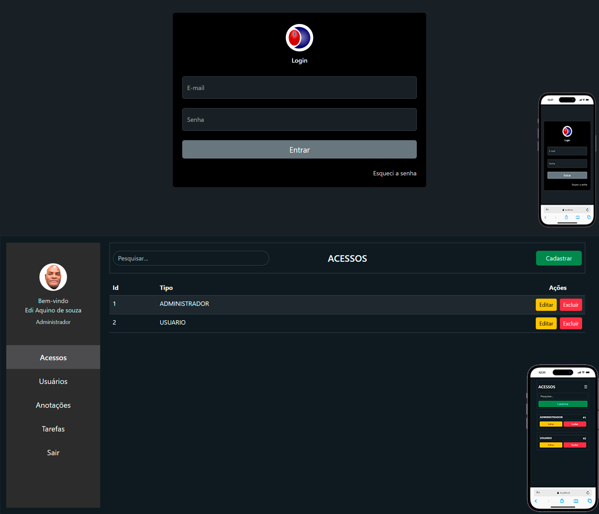

<h1 align="center">
  Anotações 📑
</h1>

  

  <a href="#-tecnologias">Tecnologias</a>&nbsp;&nbsp;&nbsp;|&nbsp;&nbsp;&nbsp;
  <a href="#-projeto">Projeto</a>&nbsp;&nbsp;&nbsp;|&nbsp;&nbsp;&nbsp;
  <a href="#memo-licença">Licença</a>

 

  

## 🚀 Tecnologias

Esse projeto foi desenvolvido com as seguintes tecnologias:

- HTML
- JavaScript
- Bootstrap
- Java - Spring Boot

📚 Conceitos aplicados no desenvolvimento do projeto:

✅ Arquitetura Cliente-Servidor

✅ Desenvolvimento de API REST com Spring Boot

✅ Integração entre Frontend e Backend

✅ CRUD Completo (Create, Read, Update e Delete)

✅ Autenticação e Autorização de Usuários

✅ Controle de Acesso por Perfil (Roles)

✅ Segurança com Spring Security

✅ Criptografia de Senhas

✅ Geração e Validação de Tokens JWT

✅ Consumo de APIs com React e Axios

✅ Gerenciamento de Estado com Hooks (useState e useEffect)

✅ Roteamento de Páginas com React Router DOM

✅ Rotas Privadas e Proteção de Recursos

✅ Upload e Manipulação de Arquivos

✅ Validação de Formulários

✅ Tratamento de Erros no Frontend e Backend

✅ Componentização de Interfaces com React

✅ Design Responsivo com Bootstrap

✅ Persistência de Dados com PostgreSQL

✅ Mapeamento Objeto-Relacional (JPA/Hibernate)

✅ Relacionamento entre Entidades

✅ Organização de Código em Camadas (Controller, Service e Repository)

✅ Versionamento de Código com Git

✅ Boas Práticas de Desenvolvimento Full Stack

## 🚧 Projeto:

Link do projeto publicado         :[https://edsof.dicadecompra.com/agencia-de-viagens/]

Link do repositório/frontend      :[https://github.com/edsof-projects/spring-boot-sistema-anotacoes-frontend]

Link do repositório/backend       :[https://github.com/edsof-projects/spring-boot-sistema-anotacoes-backend]

## 🎨 Inspiração:

Desafios da Comunidade Frontend onde todo Desenvolvedor deve ter um "Todo" 

## :memo: Licença :

Esse projeto está sob a licença MIT. Veja o arquivo [LICENSE](LICENSE) para mais detalhes.

## 👨🏿‍🦱 Autor:

   Edi Aquino de Souza
   [https://www.linkedin.com/in/edsouzza/]

## © Copyright: 

Todos os direitos reservados a [edsof informática]

  

---